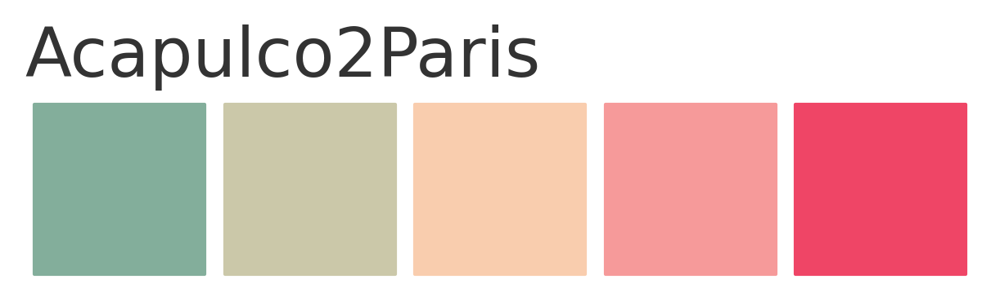
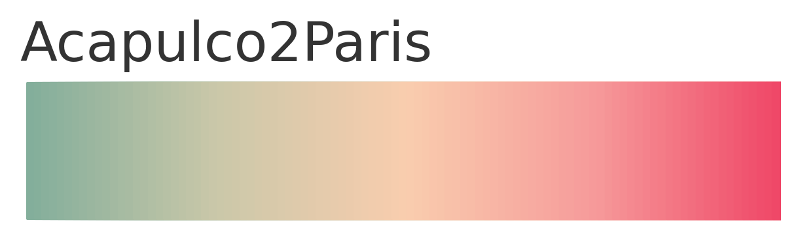
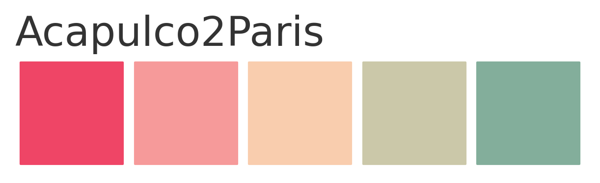

## Pylettes
### v0.1.0

`pylettes` is a lightweight `matplotlib`-compatible collection of beautiful palettes for Python 3.

See all currently available palettes [here](https://github.com/fcomitani/pylettes/blob/main/docs/figs/all_palettes.png).

### Installation

`pylettes` can be easily installed with `PiPy`

`pip install pylettes`.

To install the latest (unreleased) version you can download it from this repository by running 
 
    git clone https://github.com/fcomitani/pylettes
    cd pylettes
    python setup.py install

The only requirement is `matplotlib >= 1.3.1`.

### Usage

Palettes can be imported directly from the `pylettes` package.
They can be transformed into `matplotlib` color maps by instantiating the class and calling its `cmap` attribute.

    from pylettes import Acapulco2Paris

    custom_cmap = Acapulco2Paris().cmap

The `show_colors` method allows you to visualize and inspect any palette.

    Acapulco2Paris().show_colors()

The list of colors can be visualized as a continuous scale by providing the `continuous` argument.

    Acapulco2Paris().show_colors(continuous=True)

Palettes can be reversed by activating the `reverse` flag upon initialization.

    Acapulco2Paris(reverse=True).show_colors()

All currently available palettes can be inspected with `list_all_palettes()`, 
while `list_palettes_by_tag()` allows you to search palettes by keywords.
All available tags can be listed with `list_all_tag()`. 
Finally, to visualize multiple palettes at once use `show_multiple_palettes()`.
For example, you can inspect all colorblind-friendly palettes with

    from pylettes import list_palettes_by_tag, show_multiple_palettes

    show_multiple_palettes(list_palettes_by_tag('colorblind'))

### Contributions

I plan to keep this library updated and add more options with time. 

New palette submissions are welcome!
Submitting a palette is easy, all you need is a name,
the list of colors in hex format and associated tags.

